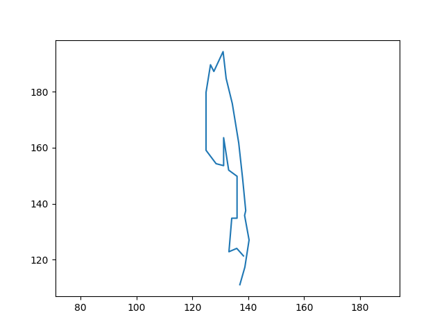

# auto-drawer-tr300-wobit

To coś miało przyjmować graf i przekładać go na kod, wyszło na połowę, robione w ramach ostatniej laby. Wrzucone na GitHub po prostu dla beki, póki główny laptop nie działa, żeby nie zapomnieć o tym, jak wrócę do głównej maszyny.

